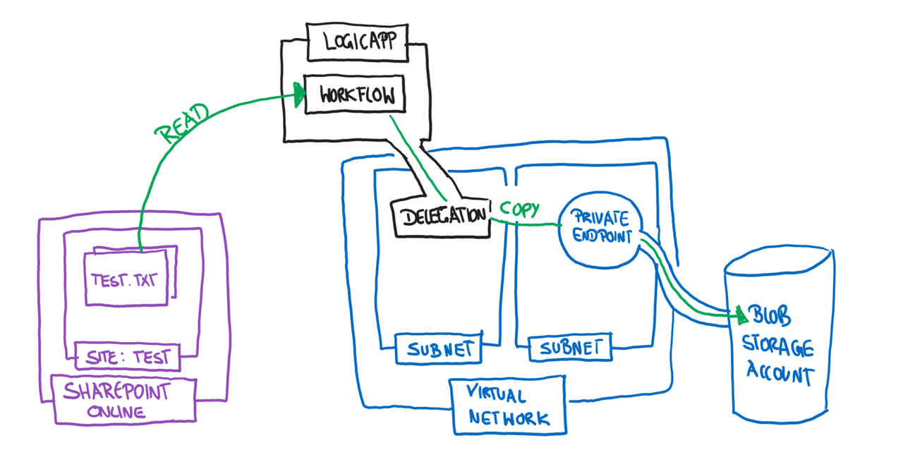
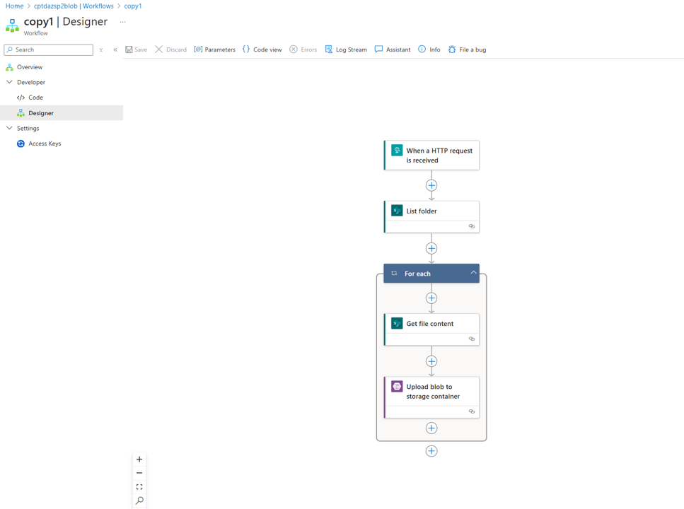
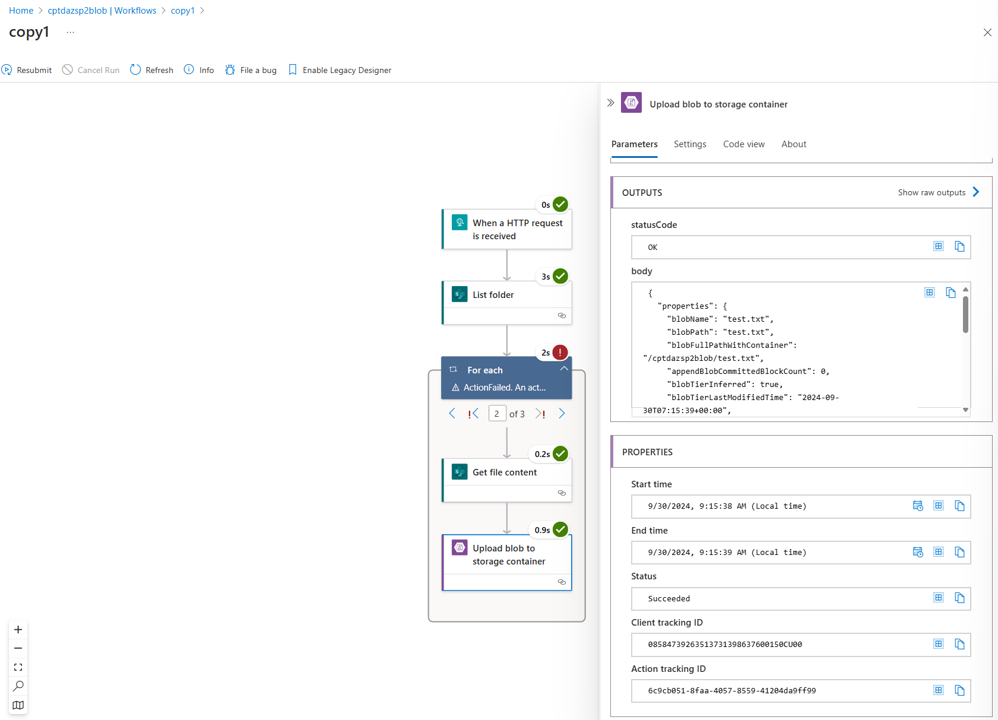

# Azure and Sharepoint

## How to copy files from Sharepoint Online to Azure Blob Storage

This is a simple example of how to copy files from a Sharepoint Online Document Library to an Azure Blob Storage Account. The Sharepoint Online Document Library is secured with Azure AD and the Azure Blob Storage Account is secured with a Private Endpoint.

> IMPORTANT: It is not the intention to explain how to configure a working Logic Apps Workflow here. Instead this article does show how to integration for outbound traffic with Private Endpoints works. Still you can find an example of how to copy files from Sharepoint Online to Azure Blob Storage in the file [./logicapp/copy1.json](./logicapp/copy1.json). The outcome could look as follow: 

We will use a Sharepoint Site called test which does contain already two files (test.txt and spiderman.txt) in the document library Documents.

We can verify if the files exist on Sharepoint Online using the PnP Powershell Module.

~~~powershell
# Install PnP Powershell SharePoint Online Management Shell
Install-Module -Name PnP.PowerShell -Scope CurrentUser
# Connect to SharePoint Online
$siteUrl = "https://myedgeorg.sharepoint.com/sites/test"
Connect-PnPOnline -Url $siteUrl -UseWebLogin

# Get files from a document library
$libraryName = "Documents"
$files = Get-PnPListItem -List $libraryName

# Display file names
foreach ($file in $files) {
    Write-Output $file.FieldValues.FileLeafRef
}
~~~

In our case we see the following output:

~~~output
test.txt
spiderman.txt
~~~

Now we are going to create the needed infrastructure resources in Azure.

> NOTE: Make sure to create the needed SSH Key Pair before you run the following commands under the folder ./bicep/ssh

~~~powershell
# Define some variables
$prefix="cptdazsp2blob"
$location="germanywestcentral"
$myObjectId=az ad signed-in-user show --query id -o tsv
# Create a resource group
az group create --name $prefix --location $location
# Validate our deployment
az deployment group validate -g $prefix --template-file .\bicep\main.bicep --parameters prefix=$prefix location=$location myObjectId=$myObjectId vmAdminName=chpinoto
# Deploy our resources
az deployment group create -g $prefix --template-file .\bicep\main.bicep --parameters prefix=$prefix location=$location myObjectId=$myObjectId vmAdminName=chpinoto
$vmid=az vm show -g $prefix -n $prefix --query "id" -o tsv
# log into the VM with bastion ssh and aad
az network bastion ssh -n $prefix -g $prefix --target-resource-id $vmid --auth-type AAD
# login with managed identity of VM2
az login --identity
# list blob container in storage account
prefix="cptdazsp2blob"
dig +short ${prefix}.blob.core.windows.net # expect private IP
az storage blob list --auth-mode login --account-name $prefix -c $prefix --query "[].name" -o tsv # expect empty result
logout
~~~

Now you need to setup an Logic App which does copy files from sharepoint to our blob storage which can only be accessed via private endpoint.
In our case the sharepoint site test does contain two files (test.txt and spiderman.txt) in the document library Documents.
After you did run the workflow you can verify the Azure Storage Resource Logs.

> NOTE: The error is expected but does not affect to copy operation from Sharepoint Online to Azure Blob Storage.

~~~powershell
# retrieve the storage resource logs via azure cli
$workspaceid=az monitor log-analytics workspace show -g $prefix -n $prefix --query customerId -o tsv
# get logs
az monitor log-analytics query -w $workspaceid --analytics-query "StorageBlobLogs | where TimeGenerated > ago(2d) | where ObjectKey startswith '/$prefix/$prefix/' | where OperationName == 'PutBlob'" --query "[].{CallerIpAddress:CallerIpAddress,ObjectKey:ObjectKey,StatusCode:StatusCode,OperationName:OperationName}"
~~~

You should see two PutBlob Operations which are send from Private IPs (10.0.1.254) which belong to the Subnet assigend to the Logic Apps outbount.

~~~json
[
  {
    "CallerIpAddress": "10.0.1.254:51050",
    "ObjectKey": "/cptdazsp2blob/cptdazsp2blob/spiderman.txt",
    "OperationName": "PutBlob",
    "StatusCode": "201"
  },
  {
    "CallerIpAddress": "10.0.1.254:51049",
    "ObjectKey": "/cptdazsp2blob/cptdazsp2blob/test.txt",
    "OperationName": "PutBlob",
    "StatusCode": "201"
  }
]
~~~

You can also verify the files in the Azure Blob Storage Account.

~~~powershell
# log again into the VM with bastion ssh and aad
az network bastion ssh -n $prefix -g $prefix --target-resource-id $vmid --auth-type AAD
# login with managed identity of VM2
az login --identity
# list blob container in storage account
prefix="cptdazsp2blob"
az storage blob list --auth-mode login --account-name $prefix -c $prefix --query "[].name" -o tsv # expect two entries test.txt and spiderman.txt
logout
~~~

## Misc

### github

~~~ bash
$prefix="cptdazsharepoint"
gh auth login
gh repo create $prefix --public
git init
git remote remove origin
git remote add origin https://github.com/cpinotossi/$prefix.git
git remote -v
git status
git add .gitignore
git add .
git commit -m"host file case"
git push origin main
~~~

### Azure CLI

~~~powershell
# delete blob in container
az storage blob delete --auth-mode login --account-name $prefix -c test -n test.txt
az storage blob delete --auth-mode login --account-name $prefix -c test -n spiderman.txt
~~~